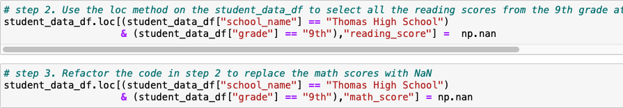
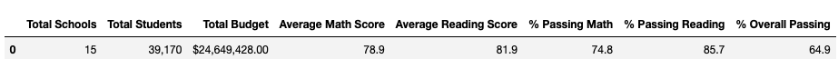
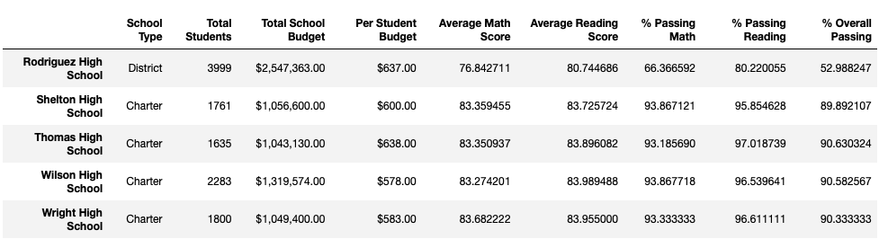
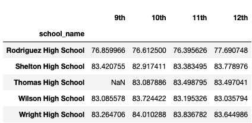
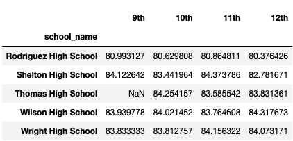
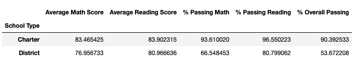

# School_District_Analysis

# 
Purpose
##
The purpose of this analysis is to replace the reading and math scores for ninth graders at Thomas High School and accordingly update district and school summary data. 

# 
Results
## 
As scores for ninth graders at Thomas High School appear to have been altered, the scores were replaced with values not as numbers (NaN). NaN values are
not considered when calculating averages. The loc() function was used to retrieve the reading and math scores for students at Thomas High School (THS) and 
in ninth grade and set them to NaN. 

This affected the scores of 461 students. After replacing the scores, the district and school summary analyses were re-
performed. Below is a summary of key data and changes. 

•	District Summary shows the total number of schools, total budget, average math score, average reading score, percentage passing math, percentage passing
reading, and percentage overall passing. The average reading and math scores were calculated using the mean() function. Note that scores for THS ninth
graders were not considered in the calculation. The passing math percentage was calculated based on students with a math score greater than or equal to 70
divided by a new student count, which excluded THS ninth graders. Similar calculations were performed for the passing reading percentage and percentage
overall passing. 

•	School Summary shows the average math score, average reading score, percentage passing math, percentage passing reading and percentage overall passing
per school along with other school data. The average math and reading scores were calculated using the groupby() function by school and then applying the
mean() function. Note that THS ninth graders were not considered in the calculation. The passing math percentage for THS was calculated considering only
tenth, eleventh and twelfth graders’ scores. The loc() function was used to calculate the number of students with a math score greater than or equal to 70.
The number of students between tenth and twelfth grade was calculated using the loc() function, using the student_data dataframe column “school_name” equal
to THS and column “grade” not equal to ninth grade. The number of students at THS in tenth, eleventh or twelfth grade totals 1,174. After recalculating the 
passing percentages, the per_school_summary dataframe was updated using the loc() function to replace the percentage passing math, percentage passing 
reading and overall percentage passing with the updated values. 

•	After re-running the per_school_summary dataframe with updated values for THS, the sort_values() function was used to sort schools based on percentage 
overall passing. THS now appeared as part of the top five schools. 

•	Impact of replacing THS ninth-grade scores:

###
o	Math and reading scores for ninth graders at THS reflect as NaN. They do not impact the math and reading scores of other grades and schools.

###
o	Spending ranges are based on school budget divided by number of students at each school. Ninth graders at THS were not excluded from this calculation. 
Scores by school spending did not change. 

###
o	School sizes are based on total number of students at each school. Ninth graders at THS were not excluded from this calculation. Scores by school size 
did not change. 

###
o	Scores by school type show the average math score, average reading score, percentage passing math, percentage passing reading and percentage overall 
passing by school type, i.e. Charter or District. The above values were impacted for school type District only as THS is a charter school. 

#
Summary
##
After replacing reading and math scores for the ninth graders at Thomas High School, changes were noted in 1.) math and reading average scores at the
district level, including changes to percentage passing for math, reading and overall, 2.) the percentage passing math, reading and overall for THS
increased, 3.)  THS became part of top five schools based on percentage overall passing and 4.) the math and reading averages as well as passing 
percentages changed based on school type. 

